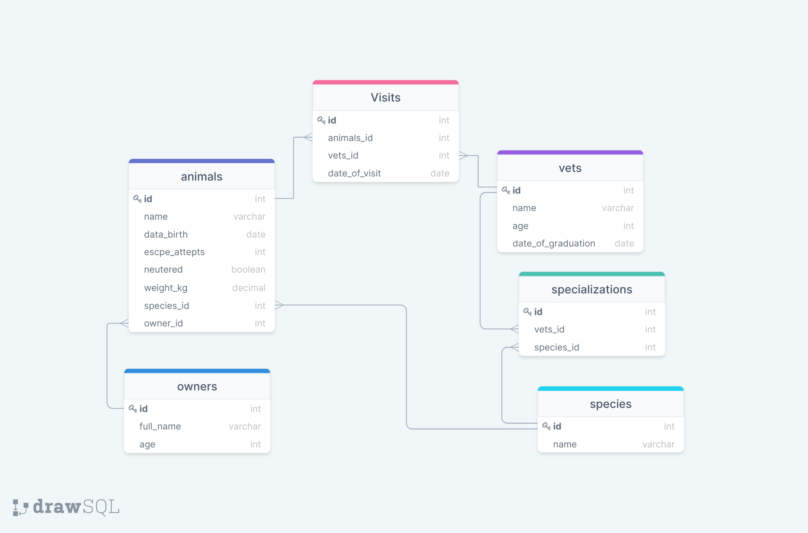

# VET-CLINIC database

> A database for a vet clinic business. Built using PostgreSQL

## Diagram

## Getting Started

This repository includes files with plain SQL that can be used to recreate a database:

- [schema.sql](./schema.sql) to create all tables.
- [data.sql](./data.sql) to populate tables with sample data.
- [queries.sql](./queries.sql) for examples of queries that can be run on a newly created database.

## About me

👤 **Smiullah Bahadur**

- GitHub: [@Bahadur](https://github.com/samiullahbahadur)
- 
- LinkedIn: [@Bahadur](https://www.linkedin.com/in/samiullah-bahadur/)

## 🤝 Contributing

Contributions, issues, and feature requests are welcome!

Feel free to check the [issues page](../../issues/).

## Show your support

Give a ⭐️ if you like this project!

## Acknowledgments

- Hat tip to anyone whose code was used
- Inspiration
- etc